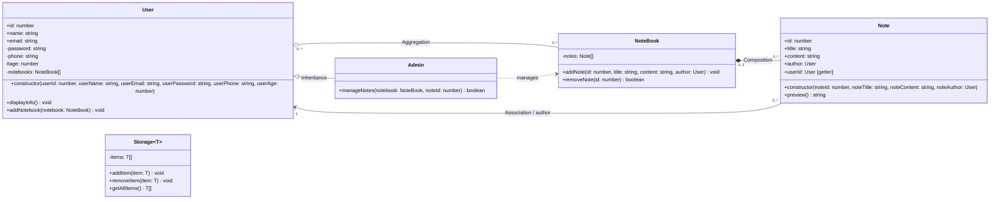

# UML — Simple Notes Management System

```mermaid
classDiagram
direction LR
class User {
  +id: number
  +name: string
  +email: string
  -password: string
  -phone: string
  #age: number
  -notebooks: NoteBook[]
  +constructor(userId: number, userName: string, userEmail: string, userPassword: string, userPhone: string, userAge: number)
  +displayInfo() void
  +addNotebook(notebook: NoteBook) void
}
class Admin {
  +manageNotes(notebook: NoteBook, noteId: number) boolean
}
class Note {
  +id: number
  +title: string
  +content: string
  +author: User
  +userId: User [getter]
  +constructor(noteId: number, noteTitle: string, noteContent: string, noteAuthor: User)
  +preview() string
}
class NoteBook {
  -notes: Note[]
  +addNote(id: number, title: string, content: string, author: User) void
  +removeNote(id: number) boolean
}
class Storage~T~ {
  -items: T[]
  +addItem(item: T) void
  +removeItem(item: T) void
  +getAllItems() T[]
}
User <|-- Admin : Inheritance
User "0..*" o-- "0..*" NoteBook : Aggregation
NoteBook "0..1" *-- "0..*" Note : Composition
Note "0..*" --> "1" User : Association / author
Admin ..> NoteBook : manages
```
